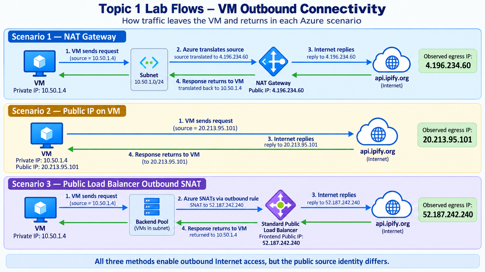

# Lab 1 — Azure VM Outbound Internet Connectivity

This beginner lab uses one private Azure VM to prove three different ways that outbound Internet connectivity can work.

> **Important:** Do not compare your Azure-assigned IP addresses with another learner's values. Azure assigns addresses dynamically from the resources you create. What matters is that the IP observed from the Internet matches the correct Azure resource for each scenario.

## Lab structure

| Lab | Scenario | What provides the public source IP? |
|---|---|---|
| [Lab 1A](./Lab-01A-NAT-Gateway/README.md) | NAT Gateway | NAT Gateway public IP |
| [Lab 1B](./Lab-01B-VM-Public-IP/README.md) | Public IP on VM | VM public IP |
| [Lab 1C](./Lab-01C-Load-Balancer-Outbound/README.md) | Standard Public Load Balancer outbound SNAT | Load Balancer frontend public IP |

## Completed traffic flows



---

# Common setup

The same VM is reused through all three scenarios so that only the outbound mechanism changes.

## Resources used

```text
Resource Group:  rg-az700-topic1-outbound-aue
Region:          australiaeast
VNet:            vnet-topic1-outbound-aue
VNet CIDR:       10.50.0.0/16
Subnet:          snet-workload
Subnet CIDR:     10.50.1.0/24
VM:              vm-topic1-outbound
NIC:             nic-topic1-outbound
```

## Step 1 — Set PowerShell variables

```powershell
$RG   = "rg-az700-topic1-outbound-aue"
$LOC  = "australiaeast"
$VNET = "vnet-topic1-outbound-aue"
$SNET = "snet-workload"
```

## Step 2 — Create the resource group

```powershell
az group create `
  --name $RG `
  --location $LOC
```

## Step 3 — Create the VNet and workload subnet

```powershell
az network vnet create `
  --resource-group $RG `
  --name $VNET `
  --location $LOC `
  --address-prefixes 10.50.0.0/16 `
  --subnet-name $SNET `
  --subnet-prefixes 10.50.1.0/24
```

## Step 4 — Disable default outbound access

```powershell
az network vnet subnet update `
  --resource-group $RG `
  --vnet-name $VNET `
  --name $SNET `
  --default-outbound false
```

Verify:

```powershell
az network vnet subnet show `
  --resource-group $RG `
  --vnet-name $VNET `
  --name $SNET `
  --query "{Name:name,Prefix:addressPrefix,DefaultOutbound:defaultOutboundAccess}" `
  --output table
```

Expected result: `DefaultOutbound` is `False`.

---

# Create the private VM

## Step 5 — Set VM variables

```powershell
$VM  = "vm-topic1-outbound"
$NIC = "nic-topic1-outbound"
```

## Step 6 — Create the NIC

```powershell
az network nic create `
  --resource-group $RG `
  --name $NIC `
  --location $LOC `
  --vnet-name $VNET `
  --subnet $SNET
```

## Step 7 — Select an available small VM size

VM SKU availability can vary by region and time. Check what is currently available instead of copying a size blindly:

```powershell
az vm list-skus `
  --location $LOC `
  --resource-type virtualMachines `
  --all `
  --query "[?restrictions==``[]`` && starts_with(name, 'Standard_B')].name" `
  --output table
```

Choose a small available B-series SKU and set it as `$VMSIZE`:

```powershell
$VMSIZE = "<AVAILABLE_B_SERIES_SIZE>"
```

Create the VM:

```powershell
az vm create `
  --resource-group $RG `
  --name $VM `
  --location $LOC `
  --nics $NIC `
  --image Ubuntu2204 `
  --size $VMSIZE `
  --admin-username azureuser `
  --generate-ssh-keys
```

Verify that the VM NIC has a private IP and no public IP:

```powershell
az network nic show `
  --resource-group $RG `
  --name $NIC `
  --query "{PrivateIP:ipConfigurations[0].privateIPAddress,PublicIP:ipConfigurations[0].publicIPAddress.id}" `
  --output json
```

Expected result:

```text
PrivateIP: <AZURE_ASSIGNED_PRIVATE_IP>
PublicIP:  null
```

---

# Browser access with Azure Bastion Developer

The VM deliberately has no public IP, so Azure Bastion Developer is used for an interactive browser terminal while keeping the VM private.

## Step 8 — Create Bastion Developer

```powershell
$BASTION = "bas-topic1-outbound"

az network bastion create `
  --name $BASTION `
  --resource-group $RG `
  --vnet-name $VNET `
  --location $LOC `
  --sku Developer
```

Verify:

```powershell
az network bastion show `
  --name $BASTION `
  --resource-group $RG `
  --query "{Name:name,Sku:sku.name,State:provisioningState}" `
  --output table
```

Expected state: `Succeeded`.

In the Azure portal:

```text
VM
→ Connect
→ Bastion
```

Use the `azureuser` account and the SSH private key created by Azure CLI.

---

# Baseline test — prove Internet access does not work yet

Run the following commands inside the VM through Bastion.

## Step 9 — Inspect the VM addresses

```bash
ip -br addr
```

Confirm that the primary interface has an address from the workload subnet.

## Step 10 — Inspect the Linux route table

```bash
ip route
```

Confirm that a default route exists. A default route alone does not guarantee that the VM has a valid public outbound mechanism.

## Step 11 — Test DNS resolution

```bash
getent ahostsv4 api.ipify.org
```

Expected: DNS returns one or more public IPv4 addresses.

**DNS result: PASS**

## Step 12 — Test real outbound Internet connectivity

```bash
curl -4 -v --connect-timeout 5 --max-time 10 https://api.ipify.org
```

Expected: the connection times out because the VM has no explicit outbound Internet mechanism yet.

**Internet result: FAIL — expected baseline behavior**

This proves that DNS resolution and outbound Internet connectivity are separate things.

---

# Continue with the three scenarios

1. [Lab 1A — NAT Gateway](./Lab-01A-NAT-Gateway/README.md)
2. [Lab 1B — Public IP on the VM](./Lab-01B-VM-Public-IP/README.md)
3. [Lab 1C — Public Load Balancer outbound SNAT](./Lab-01C-Load-Balancer-Outbound/README.md)

## Final validation pattern

| Test | What the learner should prove | Status |
|---|---|---|
| Baseline | DNS works but Internet access fails | PASS when observed |
| Lab 1A — NAT Gateway | Observed egress IP matches NAT Gateway public IP | PASS when matched |
| Lab 1B — VM Public IP | Observed egress IP matches VM public IP | PASS when matched |
| Lab 1C — Load Balancer | Observed egress IP matches Load Balancer frontend public IP | PASS when matched |

The test command used in all three working scenarios is:

```bash
curl -4 -s https://api.ipify.org
echo
```

---

# Skills gained from Lab 1

By completing Lab 1A, 1B, and 1C, the learner should be able to:

- Explain the difference between **private addressing** and a **public outbound identity**.
- Build and validate outbound Internet connectivity using a **NAT Gateway**.
- Attach and validate a **public IP directly on a VM**.
- Configure a **Standard Public Load Balancer backend pool and outbound rule**.
- Test outbound connectivity from inside a Linux VM and identify the public source IP seen by an Internet service.
- Understand the difference between **DNS resolution**, **routing**, and **outbound translation/SNAT**.
- Compare subnet-based, VM-based, and backend-pool-based outbound designs.

## Where these skills are applied in the real world

These skills are used when designing or supporting:

- Private application servers that need outbound package updates or access to third-party APIs.
- Workloads that must connect to partners that allowlist known public source IPs.
- Web and application server farms behind Azure Load Balancer.
- Test or administrative VMs that temporarily require their own public identity.
- Environments where architects must reduce unnecessary public IP exposure while still allowing controlled outbound access.
- Roles such as Azure Administrator, Cloud Engineer, Infrastructure Engineer, Network Engineer, Platform Engineer, and Cloud Support Engineer.

---

# Final assignment — build it again without instructions

When you have completed Lab 1A, 1B, and 1C, continue to the independent assignment:

[**Lab 1 Final Assignment — Real-World Outbound Connectivity Challenge**](./LAB-01-ASSIGNMENT.md)

The assignment intentionally gives you requirements but **does not provide implementation commands**. You must build the solution using what you learned in the guided labs.

After the assignment, complete the five job interview questions at the end of the assignment document.
