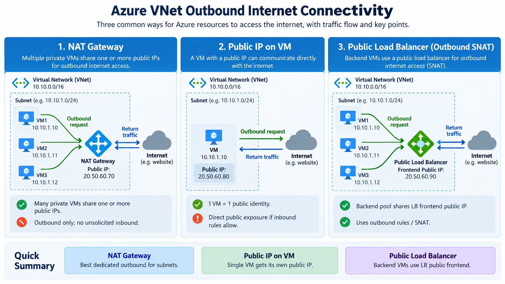

# Lab 1 — Azure VM Outbound Internet Connectivity

This beginner lab turns Topic 1 theory into a repeatable hands-on exercise. You will build one private Ubuntu VM, prove that explicit outbound connectivity is initially unavailable, and then enable outbound Internet access three different ways.

> **Important:** Do not compare Azure-assigned IP addresses with another learner's values. What matters is whether the Internet-observed source IP matches the correct Azure resource for each scenario.

## Lab outcomes

By the end of Lab 1, the learner should be able to:

- Build and validate outbound connectivity using an Azure NAT Gateway.
- Give a VM its own public IP and verify that identity.
- Configure a Standard Public Load Balancer backend pool and outbound rule.
- Test from inside a Linux VM and identify the public source IP seen by an Internet service.
- Distinguish DNS resolution from actual Internet reachability.
- Explain when subnet-level, VM-level, and backend-pool-level outbound designs are appropriate.
- Safely tear down the lab and verify that billable resources have been removed.

## Lab map

| Stage | Purpose |
|---|---|
| **Common setup** | Build the VNet, private subnet, NIC, VM, and Bastion access |
| **Baseline** | Prove DNS works while Internet connectivity fails |
| **Lab 1A** | Enable outbound access through NAT Gateway |
| **Lab 1B** | Enable outbound access through a VM public IP |
| **Lab 1C** | Enable outbound access through a Standard Public Load Balancer outbound rule |
| **Teardown** | Delete the guided lab environment and verify cleanup |
| **Assessment** | Rebuild the three approaches independently from a real-world brief |
| **Interview challenge** | Answer five job-style questions based directly on the lab |

## Lab visuals

### Concept overview



### Teaching summary used for this lab


---

# Part 1 — Common setup

The same VM is reused through all three guided scenarios so that only the outbound mechanism changes.

## Resources

```text
Resource Group:  rg-az700-topic1-outbound-aue
Region:          australiaeast
VNet:            vnet-topic1-outbound-aue
VNet CIDR:       10.50.0.0/16
Subnet:          snet-workload
Subnet CIDR:     10.50.1.0/24
VM:              vm-topic1-outbound
NIC:             nic-topic1-outbound
```

## Step 1 — Set PowerShell variables

```powershell
$RG   = "rg-az700-topic1-outbound-aue"
$LOC  = "australiaeast"
$VNET = "vnet-topic1-outbound-aue"
$SNET = "snet-workload"
```

## Step 2 — Create the resource group

```powershell
az group create `
  --name $RG `
  --location $LOC
```

## Step 3 — Create the VNet and workload subnet

```powershell
az network vnet create `
  --resource-group $RG `
  --name $VNET `
  --location $LOC `
  --address-prefixes 10.50.0.0/16 `
  --subnet-name $SNET `
  --subnet-prefixes 10.50.1.0/24
```

## Step 4 — Disable default outbound access

```powershell
az network vnet subnet update `
  --resource-group $RG `
  --vnet-name $VNET `
  --name $SNET `
  --default-outbound false
```

Verify:

```powershell
az network vnet subnet show `
  --resource-group $RG `
  --vnet-name $VNET `
  --name $SNET `
  --query "{Name:name,Prefix:addressPrefix,DefaultOutbound:defaultOutboundAccess}" `
  --output table
```

Expected: `DefaultOutbound` is `False`.

---

# Part 2 — Create the private VM

## Step 5 — Set VM variables

```powershell
$VM  = "vm-topic1-outbound"
$NIC = "nic-topic1-outbound"
```

## Step 6 — Create the NIC

```powershell
az network nic create `
  --resource-group $RG `
  --name $NIC `
  --location $LOC `
  --vnet-name $VNET `
  --subnet $SNET
```

## Step 7 — Select an available small VM size

VM SKU availability changes by region and time. Check what is currently available:

```powershell
az vm list-skus `
  --location $LOC `
  --resource-type virtualMachines `
  --all `
  --query "[?restrictions==``[]`` && starts_with(name, 'Standard_B')].name" `
  --output table
```

Choose a small available B-series size:

```powershell
$VMSIZE = "<AVAILABLE_B_SERIES_SIZE>"
```

Create the VM:

```powershell
az vm create `
  --resource-group $RG `
  --name $VM `
  --location $LOC `
  --nics $NIC `
  --image Ubuntu2204 `
  --size $VMSIZE `
  --admin-username azureuser `
  --generate-ssh-keys
```

Verify that the VM NIC has a private IP and no public IP:

```powershell
az network nic show `
  --resource-group $RG `
  --name $NIC `
  --query "{PrivateIP:ipConfigurations[0].privateIPAddress,PublicIP:ipConfigurations[0].publicIPAddress.id}" `
  --output json
```

Expected:

```text
PrivateIP: <AZURE_ASSIGNED_PRIVATE_IP>
PublicIP:  null
```

---

# Part 3 — Browser access with Azure Bastion Developer

The VM is intentionally private. Bastion Developer gives the learner an interactive browser terminal without attaching a public IP to the VM.

## Step 8 — Create Bastion Developer

```powershell
$BASTION = "bas-topic1-outbound"

az network bastion create `
  --name $BASTION `
  --resource-group $RG `
  --vnet-name $VNET `
  --location $LOC `
  --sku Developer
```

Verify:

```powershell
az network bastion show `
  --name $BASTION `
  --resource-group $RG `
  --query "{Name:name,Sku:sku.name,State:provisioningState}" `
  --output table
```

Expected state: `Succeeded`.

In the Azure portal:

```text
VM
→ Connect
→ Bastion
```

Use the `azureuser` account and the SSH private key created by Azure CLI.

---

# Part 4 — Baseline test

The baseline proves that name resolution can work even when the VM still lacks an explicit public outbound mechanism.

Run these commands inside the VM through Bastion.

## Step 9 — Inspect the VM address

```bash
ip -br addr
```

Confirm that the primary interface has an IP from the workload subnet.

## Step 10 — Inspect the route table

```bash
ip route
```

Confirm that a default route exists. A default route does **not** by itself guarantee working Internet egress.

## Step 11 — Test DNS resolution

```bash
getent ahostsv4 api.ipify.org
```

Expected: one or more IPv4 addresses are returned.

**DNS result: PASS**

## Step 12 — Test outbound Internet connectivity

```bash
curl -4 -v --connect-timeout 5 --max-time 10 https://api.ipify.org
```

Expected: the connection times out because no explicit outbound Internet mechanism has been configured yet.

**Internet result: expected to fail at baseline**

---

# Part 5 — Guided scenarios

Complete the scenarios in this order so that each test isolates one outbound method.

1. [**Lab 1A — NAT Gateway**](./Lab-01A-NAT-Gateway/README.md)
2. [**Lab 1B — Public IP on the VM**](./Lab-01B-VM-Public-IP/README.md)
3. [**Lab 1C — Standard Public Load Balancer outbound SNAT**](./Lab-01C-Load-Balancer-Outbound/README.md)

## Validation pattern

| Scenario | What must be proven |
|---|---|
| Baseline | DNS resolves but the Internet connection fails |
| Lab 1A | Internet-observed source IP matches the NAT Gateway public IP |
| Lab 1B | Internet-observed source IP matches the VM public IP |
| Lab 1C | Internet-observed source IP matches the Load Balancer frontend public IP |

Use this inside the VM for the working scenarios:

```bash
curl -4 -s https://api.ipify.org
echo
```

---

# Part 6 — Guided lab teardown

Azure resources can continue generating charges after the practical exercise is finished. Do not leave the lab running unless you deliberately want to keep it.

This lab keeps its resources in one dedicated resource group so cleanup is simple.

## Step 13 — Review what will be deleted

Run from PowerShell:

```powershell
az resource list `
  --resource-group $RG `
  --query "[].{Name:name,Type:type}" `
  --output table
```

Confirm that the resource group contains only resources created for this lab.

## Step 14 — Delete the complete lab resource group

```powershell
az group delete `
  --name $RG `
  --yes
```

Do not use `--no-wait` for this beginner lab. Allow the delete command to finish before verifying cleanup.

## Step 15 — Verify teardown is complete

```powershell
az group exists `
  --name $RG
```

Expected result:

```text
false
```

If the result is `true`, wait briefly and run the verification command again. Do not consider the lab cleaned up until the resource group no longer exists.

### Teardown success criteria

```text
Resource group exists: false
```

Because all guided-lab resources were created inside this dedicated resource group, confirming that the resource group no longer exists confirms that those contained resources have been removed as well.

---

# Part 7 — Skill application

These skills apply in real environments when you need to:

- Provide predictable outbound source IPs for partner or SaaS allowlists.
- Give private application servers controlled Internet access for updates or external APIs.
- Support web or application server farms behind a Standard Load Balancer.
- Troubleshoot why a workload can resolve DNS but still cannot establish an Internet connection.
- Avoid assigning public IPs to every VM when a shared outbound design is more appropriate.

Typical roles using these skills include Azure Administrator, Cloud Engineer, Infrastructure Engineer, Network Engineer, Platform Engineer, and Cloud Support Engineer.

---

# Part 8 — Independent assessment

After completing and tearing down the guided Lab 1 environment, rebuild and validate all three approaches from a real-world brief **without implementation commands**:

[**Lab 1 Final Assignment — Real-World Outbound Connectivity Challenge**](./LAB-01-ASSIGNMENT.md)

The same assessment ends with five interview questions:

- 2 simple
- 2 medium
- 1 hard

A learner should be able to answer them in their own words after completing the practical work.
