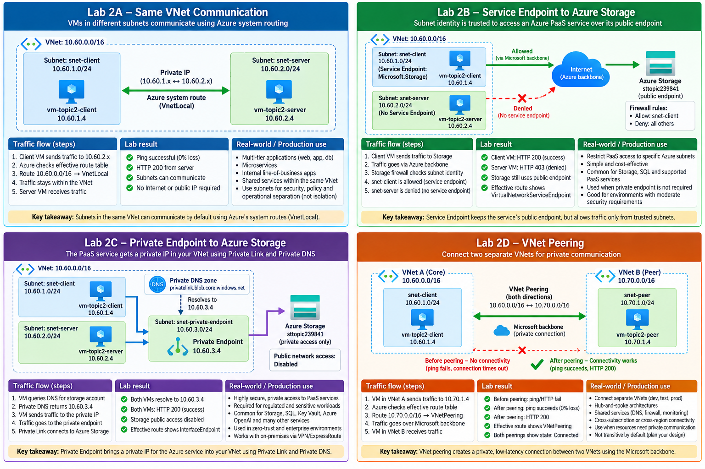

# Lab 2 — Communication Between Azure Resources

This beginner lab turns Topic 2 theory into a repeatable hands-on exercise. You will build and test four Azure communication patterns, observe what changes in routing or DNS, and then tear the environment down safely.

> **Important:** Azure-assigned IP addresses are intentionally not treated as fixed expected answers. Record the values created in your own environment and validate the relationships between resources.

## Lab outcomes

By the end of Lab 2, the learner should be able to:

- Prove communication between subnets in the same VNet.
- Configure and validate an Azure Storage Service Endpoint.
- Configure and validate an Azure Storage Private Endpoint with Private DNS.
- Configure and validate VNet Peering between two VNets.
- Read effective routes and identify `VnetLocal`, `VirtualNetworkServiceEndpoint`, `InterfaceEndpoint`, and `VNetPeering` behavior.
- Explain where each communication model is used in production.
- Safely tear down the complete lab and verify cleanup.

## Lab map

| Stage | Purpose |
|---|---|
| **Common setup** | Build the core VNet, two private subnets, two private VMs, and Bastion access |
| **Lab 2A** | Prove communication between subnets in the same VNet |
| **Lab 2B** | Restrict Azure Storage access using a Service Endpoint and Storage firewall rule |
| **Lab 2C** | Replace Service Endpoint access with a Private Endpoint and Private DNS |
| **Lab 2D** | Prove separate VNets fail before peering and communicate after peering |
| **Teardown** | Delete the complete resource group and verify cleanup |
| **Assessment** | Rebuild the four communication patterns independently from a real-world brief |
| **Interview challenge** | Answer five job-style questions based directly on the lab |

## Lab visual



---

# Part 1 — Common setup

The first three guided scenarios reuse the same core VNet and VMs so the learner can focus on what changes in the network rather than rebuilding everything each time.

## Resource plan

```text
Resource Group:     rg-az700-topic2-comm-aue
Region:             australiaeast
Core VNet:          vnet-topic2-core-aue
Core VNet CIDR:     10.60.0.0/16
Client subnet:      snet-client       10.60.1.0/24
Server subnet:      snet-server       10.60.2.0/24
Private EP subnet:  snet-private-endpoint 10.60.3.0/24
Client VM:          vm-topic2-client
Server VM:          vm-topic2-server
Peer VNet:          vnet-topic2-peer-aue 10.70.0.0/16
Peer subnet:        snet-peer         10.70.1.0/24
Peer VM:            vm-topic2-peer
```

## Step 1 — Set PowerShell variables

```powershell
$RG          = "rg-az700-topic2-comm-aue"
$LOC         = "australiaeast"
$VNET        = "vnet-topic2-core-aue"
$SNETCLIENT  = "snet-client"
$SNETSERVER  = "snet-server"
$VMCLIENT    = "vm-topic2-client"
$VMSERVER    = "vm-topic2-server"
$NICCLIENT   = "nic-topic2-client"
$NICSERVER   = "nic-topic2-server"
$BASTION     = "bas-topic2-comm"
$VMSIZE      = "Standard_B2ats_v2"
```

> If `Standard_B2ats_v2` is unavailable in your region, choose the smallest available B-series size that can run Ubuntu 22.04.

## Step 2 — Create the resource group

```powershell
az group create `
  --name $RG `
  --location $LOC
```

## Step 3 — Create the core VNet and client subnet

```powershell
az network vnet create `
  --resource-group $RG `
  --name $VNET `
  --location $LOC `
  --address-prefixes 10.60.0.0/16 `
  --subnet-name $SNETCLIENT `
  --subnet-prefixes 10.60.1.0/24
```

## Step 4 — Create the server subnet

```powershell
az network vnet subnet create `
  --resource-group $RG `
  --vnet-name $VNET `
  --name $SNETSERVER `
  --address-prefixes 10.60.2.0/24
```

## Step 5 — Disable default outbound access on both workload subnets

```powershell
az network vnet subnet update `
  --resource-group $RG `
  --vnet-name $VNET `
  --name $SNETCLIENT `
  --default-outbound false

az network vnet subnet update `
  --resource-group $RG `
  --vnet-name $VNET `
  --name $SNETSERVER `
  --default-outbound false
```

Verify:

```powershell
az network vnet subnet list `
  --resource-group $RG `
  --vnet-name $VNET `
  --query "[].{Subnet:name,Prefix:addressPrefix,DefaultOutbound:defaultOutboundAccess}" `
  --output table
```

Expected: both workload subnets show `False` for default outbound access.

## Step 6 — Create the NICs

```powershell
az network nic create `
  --resource-group $RG `
  --name $NICCLIENT `
  --location $LOC `
  --vnet-name $VNET `
  --subnet $SNETCLIENT

az network nic create `
  --resource-group $RG `
  --name $NICSERVER `
  --location $LOC `
  --vnet-name $VNET `
  --subnet $SNETSERVER
```

## Step 7 — Set a lab password without publishing it

```powershell
$LABPASSWORD = Read-Host "Enter a strong lab password"
```

Use a password that meets Azure complexity requirements. Do not reuse a production password.

## Step 8 — Create the two private VMs

```powershell
az vm create `
  --resource-group $RG `
  --name $VMCLIENT `
  --location $LOC `
  --nics $NICCLIENT `
  --image Ubuntu2204 `
  --size $VMSIZE `
  --admin-username azureuser `
  --authentication-type password `
  --admin-password $LABPASSWORD

az vm create `
  --resource-group $RG `
  --name $VMSERVER `
  --location $LOC `
  --nics $NICSERVER `
  --image Ubuntu2204 `
  --size $VMSIZE `
  --admin-username azureuser `
  --authentication-type password `
  --admin-password $LABPASSWORD
```

Verify that both VMs have private IPs and no public IPs:

```powershell
az vm list-ip-addresses `
  --resource-group $RG `
  --query "[].{VM:virtualMachine.name,PrivateIP:virtualMachine.network.privateIpAddresses[0],PublicIP:virtualMachine.network.publicIpAddresses[0].ipAddress}" `
  --output table
```

## Step 9 — Create Bastion Developer

```powershell
az extension add --name bastion

az network bastion create `
  --name $BASTION `
  --resource-group $RG `
  --vnet-name $VNET `
  --location $LOC `
  --sku Developer
```

Verify:

```powershell
az network bastion show `
  --name $BASTION `
  --resource-group $RG `
  --query "{Name:name,Sku:sku.name,State:provisioningState}" `
  --output table
```

Expected state: `Succeeded`.

---

# Part 2 — Guided scenarios

Complete the scenarios in order:

1. [**Lab 2A — Same VNet Communication**](./Lab-02A-Same-VNet-Communication/README.md)
2. [**Lab 2B — Service Endpoint to Azure Storage**](./Lab-02B-Service-Endpoint/README.md)
3. [**Lab 2C — Private Endpoint to Azure Storage**](./Lab-02C-Private-Endpoint/README.md)
4. [**Lab 2D — VNet Peering**](./Lab-02D-VNet-Peering/README.md)

## Validation summary

| Scenario | What must be proven |
|---|---|
| Lab 2A | Client VM reaches server VM across different subnets in the same VNet |
| Lab 2B | Trusted subnet reaches Storage; untrusted subnet is denied |
| Lab 2C | Storage hostname resolves to a private IP and public network access is disabled |
| Lab 2D | Separate VNets fail before peering and communicate after peering |

---

# Part 3 — Guided lab teardown

Azure resources can continue generating charges after the lab is finished. Do not leave the environment running unless you deliberately want to keep it.

## Step 10 — Review the resource group

```powershell
az resource list `
  --resource-group $RG `
  --query "[].{Name:name,Type:type}" `
  --output table
```

Confirm the resource group contains only Topic 2 lab resources.

## Step 11 — Delete the complete lab environment

```powershell
az group delete `
  --name $RG `
  --yes
```

Do not use `--no-wait` for this beginner lab. Allow deletion to complete before verifying cleanup.

## Step 12 — Verify teardown

```powershell
az group exists `
  --name $RG
```

Expected:

```text
false
```

Do not mark cleanup complete until the resource group no longer exists.

---

# Part 4 — Skill application

These skills are directly useful when designing:

- Multi-tier applications inside one VNet.
- Storage or SQL access restricted to trusted Azure subnets.
- Private access to PaaS services using Private Link and Private DNS.
- Hub-and-spoke and shared-services architectures using VNet peering.
- Private application, database, monitoring, DNS, and platform-service connectivity.
- Troubleshooting situations where routing, DNS, service firewalls, or peering state determine whether communication succeeds.

Typical roles using these skills include Azure Administrator, Cloud Engineer, Infrastructure Engineer, Network Engineer, Platform Engineer, Cloud Support Engineer, DevOps Engineer, and Solutions Architect.

---

# Part 5 — Independent assessment

After completing and tearing down the guided environment, rebuild the communication patterns from a real-world brief **without implementation commands**:

[**Lab 2 Final Assignment — Azure Resource Communication Challenge**](./LAB-02-ASSIGNMENT.md)

The assignment finishes with five interview questions:

- 2 simple
- 2 medium
- 1 hard
