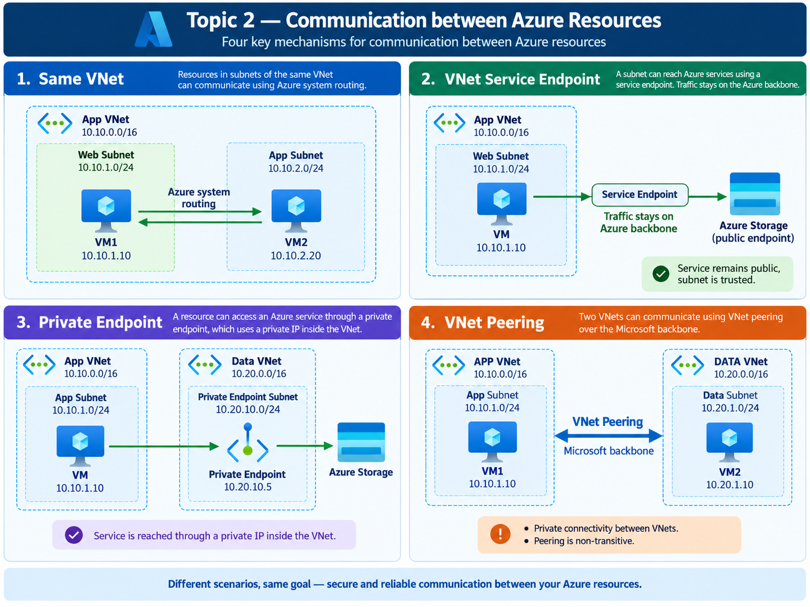

# Topic 2 — Communication Between Azure Resources

Azure resources can communicate in different ways depending on **where the source and destination live** and whether the destination is another workload or an Azure PaaS service.

This topic focuses on four common communication patterns:

1. **Same VNet communication** — resources in different subnets of the same VNet communicate using Azure system routing.
2. **VNet Service Endpoint** — a subnet is trusted to access a supported Azure PaaS service while the service keeps its public endpoint.
3. **Private Endpoint** — an Azure PaaS service is represented by a private IP inside the VNet through Azure Private Link.
4. **VNet Peering** — two separate VNets communicate privately over the Microsoft backbone.

## Concept diagram

## Core mental model

| Question | Azure mechanism |
|---|---|
| Are both workloads in the same VNet? | **System routing / VNetLocal** |
| Should a subnet be trusted to access a PaaS service that keeps its public endpoint? | **Service Endpoint** |
| Should a PaaS service be reached through a private IP in the VNet? | **Private Endpoint** |
| Are the workloads in separate VNets that need private communication? | **VNet Peering** |

The most important question is:

> **Where do the source and destination live, and which Azure networking mechanism connects them?**

## Topic 2 learning path

1. Understand the four communication patterns on this page.
2. Complete the [guided Lab 2 implementation](./LAB-02-README.md).
3. Rebuild the designs independently in the [Lab 2 final assignment](./LAB-02-ASSIGNMENT.md).
4. Answer the five job-focused interview questions at the end of the assignment.

## Start the hands-on lab

[**Continue to Lab 2 — Communication Between Azure Resources**](./LAB-02-README.md)
