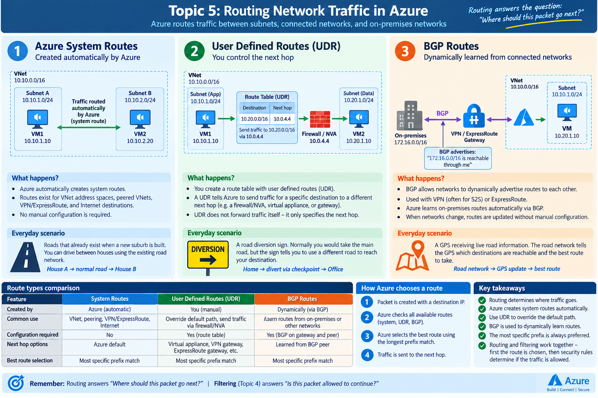

# Topic 5 — Routing Network Traffic

Routing answers one question: **Where should this packet go next?**

This topic covers three route sources Azure can use:

1. **Azure System Routes** — routes Azure creates automatically.
2. **User Defined Routes (UDR)** — routes you create to override the normal path and choose a next hop.
3. **BGP Routes** — routes learned dynamically from connected networks such as VPN or ExpressRoute peers.

## Traffic-flow diagram

## Core mental model

- **System route:** Azure's default road.
- **UDR:** your road sign that says traffic for a destination must use a different next hop.
- **BGP:** connected routers dynamically advertise which destination prefixes are reachable through them.

## Packet flow

1. A packet is created with a destination IP.
2. Azure checks the available routes.
3. Azure selects the best route, usually by longest-prefix match.
4. Azure sends the packet to the selected next hop.

## Everyday-world mapping

- **System Route:** roads that already exist in a suburb.
- **UDR:** a diversion sign telling traffic to take a specific road or checkpoint.
- **BGP:** GPS receiving live information about which destinations are reachable through which roads.

## Key distinction

- **Routing = Where should the packet go?**
- **Filtering = Is the packet allowed to continue?**

A UDR does not forward traffic itself; it only tells Azure which next hop to use.
